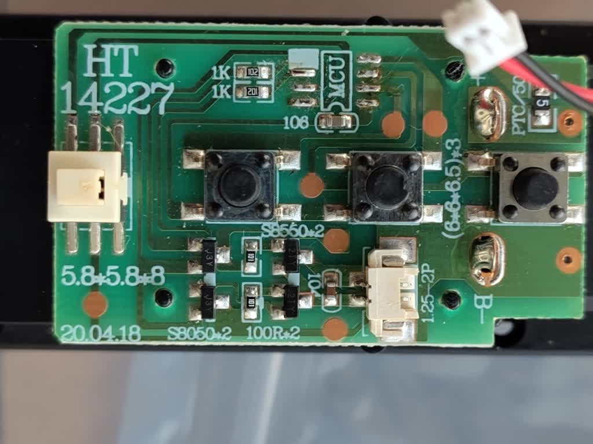
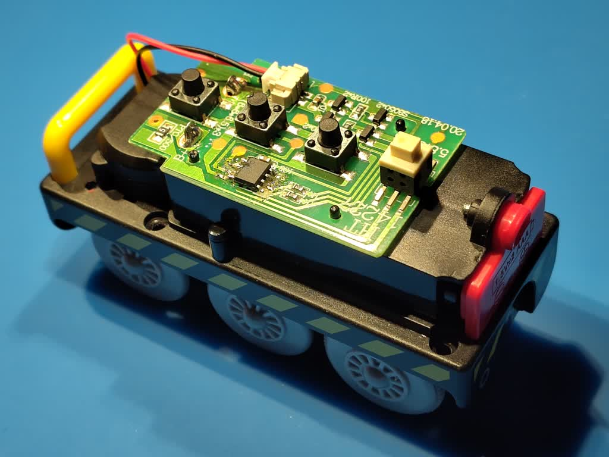
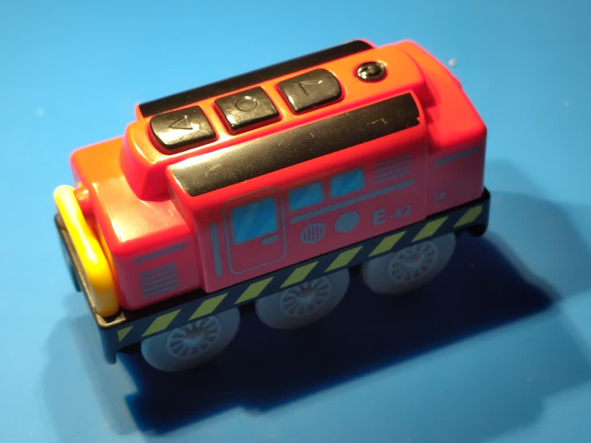

# Software for the Padauk PMS150C to control a toy train locomotive (the original mcu was fried)



The MCU footprint is compatible SOIC-8 PIC MICRO (clones)

The original chip didn't have markings on the top, and did have markings on the bottom,
so it could very well have been a padauk originally.


```
                                   _____________
                                  / _           \
                             3V -| (_)           |- GND
                                 |               |
   backward button (active low) -|   PMS150C     |- backward ctl
                                 |               |
    forward button (active low) -|   SOIC-8      |- forward ctl
                                 |               |
       stop button (active low) -|               |- not connected
                                  \_____________/

```

|              | backward ctl | forward ctl |
| ------------ | ------------ | ----------- |
|   off        | low          | low         |
| forward      | low          | high        |
| backward     | high         | low         |
| bad times(?) | high         | high        |




# This repo uses the free-pdk programming stack

https://free-pdk.github.io/

software:

* https://github.com/free-pdk/easy-pdk-programmer-software

hardware:

* https://github.com/brainsmoke/pdk_prog
* https://github.com/free-pdk/easy-pdk-programmer-lite-hardware
* https://github.com/free-pdk/easy-pdk-programmer-hardware


